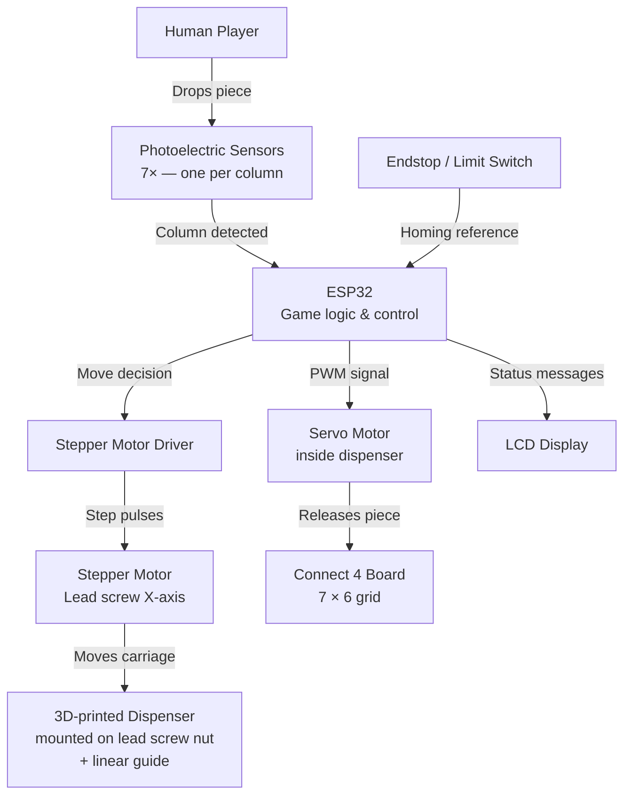

<div align="center">

# 🤖 Autonomous Connect 4 Machine
### Integrated Project II · Mechatronics Engineering · UVic-UCC 2026

[](https://www.gnu.org/licenses/gpl-3.0)
[](https://isocpp.org/)
[](https://www.espressif.com/)
[]()
[]()

*A fully autonomous physical Connect 4 machine: the ESP32 detects each piece drop via photoelectric sensors, computes the best move, and physically delivers the piece using a motorized lead screw dispenser.*

</div>

---

## 📋 Table of Contents

- [About the Project](#-about-the-project)
- [How It Works](#-how-it-works)
- [System Architecture](#-system-architecture)
- [Hardware Components](#-hardware-components)
- [Software Stack](#-software-stack)
- [Repository Structure](#-repository-structure)
- [Getting Started](#-getting-started)
- [Current Status](#-current-status)
- [Team](#-team)
- [License](#-license)

---

## 🎯 About the Project

This project is developed as part of **Integrated Project II** in the **Mechatronics Engineering** degree at the Universitat de Vic – Universitat Central de Catalunya (UVic-UCC).

The goal is to build a machine that plays **Connect 4 autonomously** against a human opponent. The machine detects the human's move through **photoelectric sensors**, decides which column to play, moves a **3D-printed piece dispenser** along a lead screw to the correct position, and drops a piece using a **servo motor** — all controlled by an **ESP32**.

---

## ⚙️ How It Works

```
Human drops a piece
        │
        ▼
Photoelectric sensor (1 per column)
detects the piece passing through
        │
        ▼
ESP32 updates the board state
        │
        ▼
Software selects the best column to play
        │
        ▼
Stepper motor moves the dispenser
along the lead screw to target column
        │
        ▼
Endstop used for homing / position reference
        │
        ▼
Servo motor releases one piece
from the dispenser stack
        │
        ▼
Piece falls into the board
        │
        ▼
LCD displays game state (e.g. "Game Over")
```

> ♻️ **Note:** Piece recovery and board reset are performed manually between games.

---

## 🏗 System Architecture



---

## 🔧 Hardware Components

| Component | Description | Status |
|-----------|-------------|--------|
| ESP32 | Main microcontroller — game logic, motor & sensor control | ✅ Ready |
| Stepper motor | X-axis movement via lead screw | ✅ Tested |
| Stepper driver | Motor driver for step/direction control | ✅ Ready |
| Lead screw (husillo) | Linear X-axis mechanism | ✅ Ready |
| Linear guide + carriage | Supports and guides the dispenser | ✅ Ready |
| Micro servo | Releases one piece at a time from the dispenser | ✅ Tested |
| Photoelectric sensors | 7× emitter-receiver pairs, one per column, in dedicated holes at the top of the board | ✅ Tested |
| Series resistors | Required for correct photoelectric sensor detection | ✅ Installed |
| Endstop / Limit switch | Homing reference, located at one end of the lead screw | ✅ Ready |
| LCD display | Shows game status (e.g. "Your turn", "Game Over") | ✅ Ready |
| Connect 4 board | 7×6 grid with 7 small sensor holes at the top | ✅ Ready |

### 🔍 Sensor detail

Each of the 7 photoelectric sensors is positioned in a dedicated small hole at the **top of the Connect 4 board**, one per column. When a piece passes through the column opening, it breaks the emitter–receiver beam, and the ESP32 registers which column was played. Each sensor is wired in series with a resistor to ensure reliable detection.

---

## 💻 Software Stack

- **Microcontroller:** ESP32
- **Language:** C++
- **Framework:** Arduino / ESP-IDF
- **Key modules:**
  - `detection` — reads photoelectric sensors, maps to column index
  - `motion` — stepper step generation, homing routine, position control
  - `servo` — piece release timing and control
  - `game` — board state, win detection, move selection
  - `display` — LCD output (game status, prompts)

---

## 📁 Repository Structure

```
Team7/
├── documentation/        # Reports, meeting notes, design documents
├── electronics/          # Schematics, wiring diagrams
├── mechanical/           # CAD files, 3D-print STLs, technical drawings
├── programming/          # C++ source code (ESP32)
├── LICENSE
└── README.md
```

---

## 🚀 Getting Started

### Prerequisites

- [Arduino IDE](https://www.arduino.cc/en/software) or [PlatformIO](https://platformio.org/) with ESP32 board support
- ESP32 board package installed
- Required libraries:
  - `AccelStepper` — stepper motor control
  - `ESP32Servo` — servo control
  - `LiquidCrystal_I2C` *(or equivalent)* — LCD display

### Clone the repository

```bash
git clone https://github.com/Integrated-Project-2-2026-UVic-UCC/Team7.git
cd Team7/programming
```

### Flash to ESP32

1. Open the project in Arduino IDE or PlatformIO
2. Select board: **ESP32 Dev Module**
3. Connect ESP32 via USB
4. Upload

> ⚠️ Ensure all hardware (sensors, motors, endstop) is connected and the dispenser is homed to the endstop before powering on.

---

## 📊 Current Status

| Phase | Task | Status |
|-------|------|--------|
| 1 | Initial design & planning | ✅ Done |
| 2 | Component procurement | ✅ Done |
| 3 | 3D printing — dispenser & mechanical parts | ✅ Done |
| 3 | Electronics wiring & assembly | ✅ Done |
| 3 | Individual component testing (sensors, motor, servo) | ✅ Done |
| 4 | Full system integration | 🔄 In progress |
| 4 | Software validation on real hardware | 🔄 In progress |
| 5 | Final calibration & demo | ⏳ Pending |

---

## 👥 Team

| Name | Role | GitHub |
|------|------|--------|
| Arnau Arcarons | Project Manager | [@arnauarca](https://github.com/arnauarca) |
| Pau Vila | Mechanical Leader | — |
| Victor Ruiz | Electronics Leader | — |
| Albert Llimós | Programming Leader | — |

> 📌 *Project supervised by Moisès and Clara, faculty of Mechatronics Engineering at UVic-UCC.*

---

## 📄 License

This project is licensed under the **GNU General Public License v3.0**.
See the [`LICENSE`](LICENSE) file for full details.

---

<div align="center">
  <sub>Built with ⚙️ by Team 7 · UVic-UCC Mechatronics Engineering · 2026</sub>
</div>


# 🤖 Autonomous Connect 4 Machine

University academic project focused on designing and developing a fully autonomous physical **Connect 4 (4 in a Row)** machine capable of playing against a human opponent.

The system will combine:

- Physical mechanical design  
- Raspberry Pi control system  
- Artificial Intelligence (Minimax + Alpha-Beta pruning)  
- Automatic piece recovery and mechanical sorting  
- Full autonomous game reset  

---

# 🎯 Project Objective

To build a fully autonomous machine capable of:

1. Detecting the board state  
2. Computing the optimal move  
3. Physically executing the move  
4. Recovering all pieces at the end of the match  
5. Mechanically sorting the pieces (without sensors)  
6. Automatically preparing for the next game  

The project is currently in the **early conceptual stage**.

---

# 🏗 System Architecture (Conceptual)

## Main Subsystems

### 1️⃣ Mechanical System
- Vertical 7x6 board  
- X-axis moving head mechanism  
- Piece drop system  
- Bottom trap door for board clearing  
- Fully mechanical piece sorting system (no sensors)  
- Vertical storage reservoirs  

### 2️⃣ Electronics
- Raspberry Pi (model TBD)  
- Stepper motor for lateral movement  
- Motor driver  
- Servo motor for piece release  
- Endstops for homing  
- Separate power supply for logic and motors  

### 3️⃣ Software
- AI engine  
- Game logic  
- Motion control  
- Detection system (camera or mechanical detection – TBD)

---

# 🧠 Artificial Intelligence

The AI uses:

- Minimax algorithm  
- Alpha-Beta pruning  
- Heuristic evaluation  
- Center-column prioritization  
- Immediate win/block detection  

The algorithm is optimized to run efficiently on a Raspberry Pi.

---

# 📁 Project Structure

